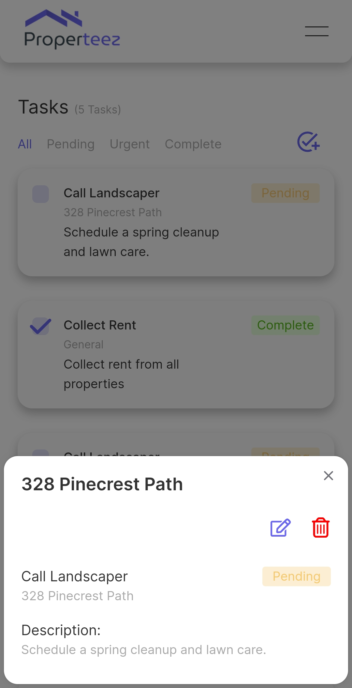

<!-- ##### *[Click Here](https://youtu.be/BVDUV6CEojs) for demo* -->

##### *[Click Here](https://properteez.kurtisgarcia.dev) for live site*

This streamlined application optimizes user experience for managing investment properties efficiently. Users can input mortgage and rent amounts, track renters and lease terms, and monitor payment statuses, distinguishing between current and past due payments. The app ensures security with robust user authentication.

### How To Use

- ##### *Navbar:*
    - Click "Add Property" button to go to Add Property page.
    - Click "Dashboard" button to go to Dashboard page.
    - Click "Properties" button to go to Properties page.
    - Click "Tasks" button to go to Tasks page.
    - Click "Log Out" button to go to log out of application.

- ##### *Dashboard page:*
    - Get an overview of your investment properties.
    - View your total amount of properties, monthly profit, and amount of "Past Due" homeowners.
    - View the 10 most recent properties added.
    - Click on each property to open popup allowing ability to view/edit details or delete property.

- ##### *Properties page:*
    - View your total amount properties.
    - View all properties.
    - Filter through properties by "All", "Current", "PastDue", "Vacant".
    - Click on "Add Property" button to add a new property.
    - Click on each property to open popup allowing ability to view/edit details or delete property.

- ##### *Property Modal:*
    - View image of property.
    - View property details such as address, type of home, mortgage/rent amount, monthly profit and lease term.
    - View renter details such as name, phone number, and email.
    - Edit/Delete property.

- ##### *Tasks page:*
    - View all of your tasks.
    - Click on each task to view the details of the task.
    - Edit/Delete task.

- ##### *Task Modal:*
    - View task details.
    - Edit/Delete task.

### Motivation
I aimed to push my boundaries by creating a full-stack project tailored to my personal use. Given my interest in real estate investing, I chose to develop an application to manage various investment properties and their respective renters.

### Challenges and Solutions
During this project, I faced numerous challenges, with one of the most significant being the integration of authentication. Initially, I used regular cookies on the frontend, unaware that this approach posed a considerable security risk due to its accessibility. To address this issue, I revised my logic to authenticate serverside. Additionally, I ensured that the cookies were set as HTTP cookies, making them inaccessible to JavaScript and thereby enhancing the application's security.

### Mobile Screenshots

### Mobile Screenshots

### Features
- Users can track all of their investment properties.
- Users can add, edit, delete, and view properties.
- Users can add, edit, delete, and view tasks for each property.

**Technologies Used:**
- [Next.js](https://nextjs.org/)
- [CSS Modules](https://nextjs.org/docs/app/building-your-application/styling/css-modules)
- [Node.js](https://nodejs.org/en)
- [Express.js](https://expressjs.com/)
- [PostgreSQL](https://www.postgresql.org/)
- [ElephantSQL](https://www.elephantsql.com/)
- [Bcrypt](https://www.npmjs.com/package/bcrypt)
- [JWT Tokens](https://jwt.io/)
- [Cookie Parser](https://www.npmjs.com/package/cookie-parser)
- [Multer](https://www.npmjs.com/package/multer)
- [Google Cloud Storage Buckets](https://cloud.google.com/storage/docs/json_api/v1/buckets)
